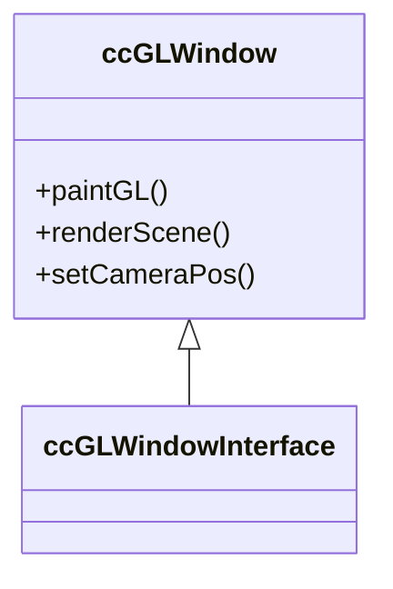

# CloudCompare OpenGL渲染架构分析

## 1. 核心模块分析
### qCC_glWindow模块
- 主类：ccGLWindow
- 核心功能：
  - OpenGL上下文管理
  - 渲染循环控制
  - 视口和相机管理

## 2. 关键接口
1. 渲染接口：
   - `paintGL()`: 主渲染入口
   - `renderScene()`: 场景渲染核心

## 3. 类关系图

## 4. 渲染管线流程
1. 初始化阶段：
   - OpenGL上下文创建
   - 着色器加载
2. 渲染阶段：
   - 视口设置
   - 相机矩阵计算
   - 场景对象渲染
3. 后期处理：
   - FBO处理
   - 屏幕空间效果

## 5. 待分析问题
- OpenGL版本兼容性
- 平台特定代码分布
- 性能关键路径